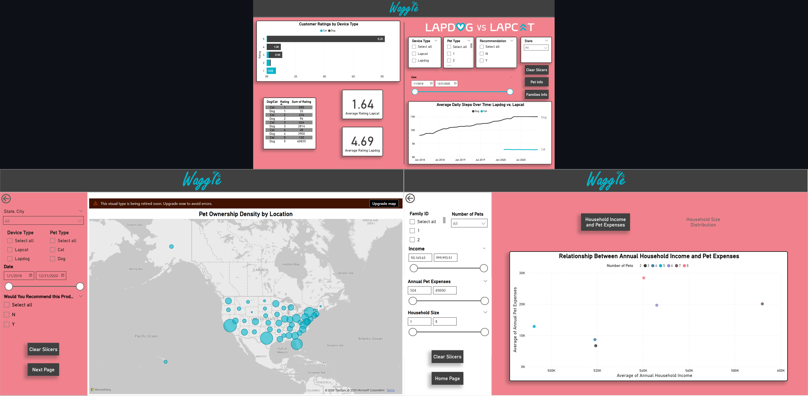

# Creating-Visualizations-with-Power-Bl

**Objective:** Develop a boardroom-ready Power BI dashboard to analyze and compare the performance, user satisfaction, and demographic insights of Waggle’s Lapdog and Lapcat smart fitness devices, enabling executives to evaluate the viability of launching the feline product.

**What I did:**
- Analyzed the provided Power BI data model to understand device usage, activity tracking, satisfaction scores, and demographic attributes.
- Designed interactive visualizations to compare average daily steps between Lapdog and Lapcat devices over time.
- Evaluated customer satisfaction levels and identified trends and differences between dog and cat device users.
- Built demographic analysis visuals to examine differences in pet ownership, household characteristics, and regional patterns.
- Created a multi-page dashboard layout prioritizing executive-level insights, with clear separation of performance metrics, demographic comparisons, and household insights.
- Implemented interactive slicers to allow dynamic filtering by device type, location, demographics, and time periods.
- Applied company branding guidelines, including official color palette, logos, and visual identity for executive presentation readiness.
- Added navigation buttons and bookmarks to enhance usability, enable page navigation, and allow dynamic switching between visualizations.
- Ensured clean layout, visual hierarchy, and best practices in dashboard design for clarity and decision-making.

**Tech stack:** Power BI, DAX, Data Modeling, Data Visualization, Business Intelligence, Interactive Dashboards

**Key dashboard features:**
- Device performance comparison (Lapdog vs Lapcat)
- Average daily activity trends over time
- Customer satisfaction analysis
- Demographic and household insights
- Interactive slicers and filters
- Multi-page executive dashboard layout
- Bookmark-enabled dynamic visual switching
- Navigation buttons with interactive behavior

**Impact:** Delivered an executive-level dashboard enabling stakeholders to evaluate product performance, understand user behavior, and support data-driven decision-making regarding the potential launch of the Lapcat device.
